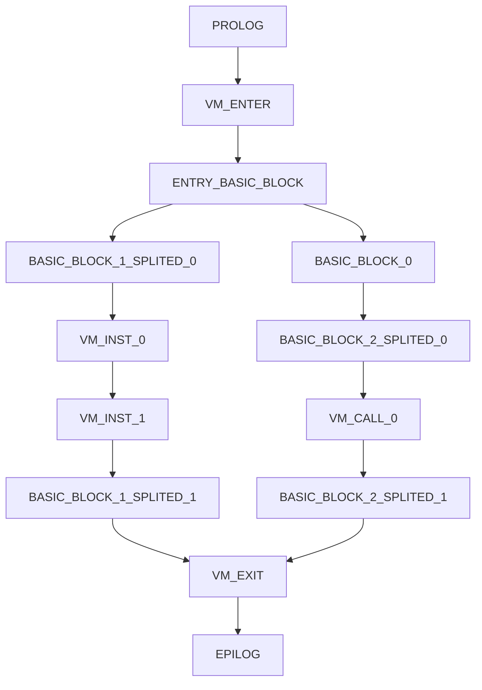
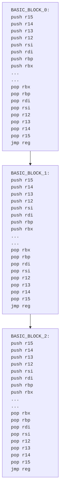

# Remarks
These are the notes I gathered while reversing `stub.dll`, which I decided to turn into a somewhat blogpost. Most of the things described here have already been discussed publicly, especially on the [CodeDefender](https://codedefender.io/) discord. So, if you're interested in Griffin or in obfuscation/deobfuscation in general, I recommend joining.

This blogpost will try to provide an overview of how Griffin operates and its components; deobfuscation will not be covered. Needless to say, much of what will be written here is speculative and should be taken with a grain of salt. Corrections and feedback are greatly appreciated.   

# Griffin
Some routines in `stub.dll` are obfuscated using what the community refers to as Griffin. In the version I have, at least five routines are obfuscated, including the `KiUserExceptionDispatcher` hook. 


*Here is part of a basic block from a function obfuscated with Griffin: a sea of bitwise operations that screams MBA is Griffin's signature.*

Judging by the fact that Griffin creates a new section to store the virtualized code, it is probably safe to assume that it is a b2b (bin to bin) virtualizer like the others (VMP, Themida, etc.). But compared to something like VMP, it’s different in several ways. Griffin doesn’t have handlers (at least not the kind you’d find in VMP, for example), and it doesn’t have a virtual stack. To better understand it, I will begin by roughly outlining what I believe to be its workflow and explain it in more detail later.

Given a target function, what i believe Griffin do is:
- Identify and store both the epilog and prolog of the function. As will be discuted later, Griffin depends on both of these be preserved.
- Explore and build the target function CFG.
- For every basic block, lifts all his instructions on a 1:1 way; flags gets calculated explicitly(without pushfq/popfq). I wouldn’t be surprised if they’re using Remill. Basic blocks will be splitted when necessary to include both `VM_CALL` and `VM_INST` stubs. Those will be explained later.
	```asm
	...
 	mov rax, 0x2
	mov rcx, 0x2
	add rcx, rax
	...
	```
	*Instructions from a exemplary basic block*
	
	```cpp
	__attribute__((noinline)) void __notGriffin_basic_block0(Context& ctx) {
		...
 		auto &RAX = ctx.v_rax.q;
 		auto &RCX = ctx.v_rax.q;
  		...
 		RAX = 0x2;
	    ...
		RCX = 0x2;
	  	...
		RAX += RCX;
		...
	}
	```
	*The lifted counterpart, this is the Remill style lifiting*
	
	I found it very productive to think about Griffin’s virtualized code in terms of its lifted code, so from now on, when relevant, I’m going to adopt this strategy. The C++ 		 		representation of the lifted code is entirely inspired by [this document](https://github.com/lifting-bits/remill/blob/master/docs/LIFE_OF_AN_INSTRUCTION.md).

- Produces both `VM_ENTER` and `VM_EXIT` functions. The nature of this functions will be explained later. 
- Apply MBA on top of everything(LLVM?).


*CFG example of a typical function protected by Griffin. May be important to keep it in mind moving forward.*

# VM_(ENTER|EXIT) and Context
`Context` is part of the Griffin runtime VM. It holds the virtual registers and the delta between the DLL base address and the its preferred address. For visualization purposes, i’ll represent it like this, which is basically a simplified version of Remill `State` struct:
```cpp
// https://github.com/lifting-bits/remill/blob/36c1d3ced320401b8fe80a572113d77a145f020e/include/remill/Arch/X86/Runtime/State.h#L389
struct RFLAG {
    union {
        struct {
            uint32_t cf : 1;
            uint32_t must_be_1 : 1;
            uint32_t pf : 1;
            uint32_t must_be_0a : 1;
            uint32_t af : 1;
            uint32_t must_be_0b : 1;
            uint32_t zf : 1;
            uint32_t sf : 1;
            uint32_t tf : 1;
            uint32_t _if : 1;
            uint32_t df : 1;
            uint32_t of : 1;
            uint32_t iopl : 2;
            uint32_t nt : 1;
            uint32_t must_be_0c : 1;
            uint32_t rf : 1;
            uint32_t vm : 1;
            uint32_t ac : 1;
            uint32_t vif : 1;
            uint32_t vip : 1;
            uint32_t id : 1;
            uint32_t reserved_eflags : 10;
            uint32_t reserved_rflags;
        } part;
        struct {
            uint64_t q;
        } full;
    };
} __attribute__((packed));

// https://secret.club/2021/09/08/vmprotect-llvm-lifting-1.html
struct Register {
  union {
    alignas(1) struct {
      uint8_t b0;
      uint8_t b1;
      uint8_t b2;
      uint8_t b3;
      uint8_t b4;
      uint8_t b5;
      uint8_t b6;
      uint8_t b7;
    } byte;
    alignas(2) struct {
      uint16_t w0;
      uint16_t w1;
      uint16_t w2;
      uint16_t w3;
    } word;
    alignas(4) struct {
      uint32_t d0;
      uint32_t d1;
    } dword;
    alignas(8) uint64_t q;
  } __attribute__((packed));
} __attribute__((packed));

struct Context {
    // Virtual Registers
    Register v_rax  { 0 };
    Register v_rbx  { 0 };
    Register v_rcx  { 0 };
    Register v_rdx  { 0 };
    Register v_rsi  { 0 };
    Register v_rdi  { 0 };
    Register v_rbp  { 0 };
    Register v_r8   { 0 };
    Register v_r9   { 0 };
    Register v_r10  { 0 };
    Register v_r11  { 0 };
    Register v_r12  { 0 };
    Register v_r13  { 0 };
    Register v_r14  { 0 };
    Register v_r15  { 0 };

    // Virtual RFLAG
    RFLAG v_rflag   { 0 };

    uintptr_t delta { 0 };
};
```

`VM_ENTER` allocates the `Context`, maps native registers to their virtual counterparts, and stores the delta between the DLL base address and its preferred address:
```diff
+stub2:00000000004F8552 9C                                            pushfq
+stub2:00000000004F8553 48 8D A4 24 D8 FD FF FF                       lea     rsp, [rsp-228h]
+stub2:00000000004F855B 48 8B 84 24 28 02 00 00                       mov     rax, [rsp+228h]
+stub2:00000000004F8563 48 89 84 24 B0 01 00 00                       mov     [rsp+1B0h], rax
-stub2:00000000004F856B 80 E8 70                                      sub     al, 70h ; 'p'
+stub2:00000000004F856E 48 8B 84 24 30 02 00 00                       mov     rax, [rsp+230h]
+stub2:00000000004F8576 48 89 84 24 A8 00 00 00                       mov     [rsp+0A8h], rax
-stub2:00000000004F857E 8C C0                                         mov     eax, es
-stub2:00000000004F8580 83 C0 79                                      add     eax, 79h ; 'y'
+stub2:00000000004F8583 48 89 8C 24 B0 00 00 00                       mov     [rsp+0B0h], rcx
-stub2:00000000004F858B FF C8                                         dec     eax
+stub2:00000000004F858D 48 89 54 24 60                                mov     [rsp+60h], rdx
-stub2:00000000004F8592 D2 F1                                         sal     cl, cl
-stub2:00000000004F8594 D0 F2                                         sal     dl, 1
+stub2:00000000004F8596 48 89 5C 24 40                                mov     [rsp+40h], rbx
-stub2:00000000004F859B 41 23 C7                                      and     eax, r15d
+stub2:00000000004F859E 48 89 AC 24 F8 01 00 00                       mov     [rsp+1F8h], rbp
+stub2:00000000004F85A6 48 89 B4 24 30 01 00 00                       mov     [rsp+130h], rsi
+stub2:00000000004F85AE 48 89 BC 24 68 01 00 00                       mov     [rsp+168h], rdi
-stub2:00000000004F85B6 83 C8 D2                                      or      eax, 0FFFFFFD2h
-stub2:00000000004F85B9 D3 C9                                         ror     ecx, cl
+stub2:00000000004F85BB 4C 89 84 24 18 01 00 00                       mov     [rsp+118h], r8
-stub2:00000000004F85C3 32 C8                                         xor     cl, al
-stub2:00000000004F85C5 41 C0 F0 55                                   sal     r8b, 55h
+stub2:00000000004F85C9 4C 89 8C 24 38 01 00 00                       mov     [rsp+138h], r9
+stub2:00000000004F85D1 4C 89 94 24 C0 01 00 00                       mov     [rsp+1C0h], r10
-stub2:00000000004F85D9 3C A4                                         cmp     al, 0A4h
-stub2:00000000004F85DB 41 80 F8 D5                                   cmp     r8b, 0D5h
-stub2:00000000004F85DF 45 1B C7                                      sbb     r8d, r15d
-stub2:00000000004F85E2 41 80 F0 D3                                   xor     r8b, 0D3h
-stub2:00000000004F85E6 FF C1                                         inc     ecx
-stub2:00000000004F85E8 D0 C1                                         rol     cl, 1
-stub2:00000000004F85EA 41 C0 E8 E2                                   shr     r8b, 0E2h
-stub2:00000000004F85EE C0 EA 07                                      shr     dl, 7
-stub2:00000000004F85F1 8B CF                                         mov     ecx, edi
-stub2:00000000004F85F3 45 23 C6                                      and     r8d, r14d
+stub2:00000000004F85F6 4C 89 9C 24 D8 00 00 00                       mov     [rsp+0D8h], r11
-stub2:00000000004F85FE D3 C9                                         ror     ecx, cl
+stub2:00000000004F8600 4C 89 64 24 68                                mov     [rsp+68h], r12
-stub2:00000000004F8605 41 D3 F3                                      sal     r11d, cl
-stub2:00000000004F8608 44 22 D8                                      and     r11b, al
+stub2:00000000004F860B 4C 89 AC 24 20 01 00 00                       mov     [rsp+120h], r13
+stub2:00000000004F8613 4C 89 B4 24 F8 00 00 00                       mov     [rsp+0F8h], r14
-stub2:00000000004F861B D1 FA                                         sar     edx, 1
-stub2:00000000004F861D F5                                            cmc
-stub2:00000000004F861E 41 D1 EB                                      shr     r11d, 1
-stub2:00000000004F8621 9F                                            lahf
+stub2:00000000004F8622 4C 89 BC 24 20 02 00 00                       mov     [rsp+220h], r15
-stub2:00000000004F862A D0 CA                                         ror     dl, 1
-stub2:00000000004F862C 41 D2 DA                                      rcr     r10b, cl
-stub2:00000000004F862F D0 C2                                         rol     dl, 1
+stub2:00000000004F8631 48 8D 0D C8 79 B0 FF                          lea     rcx, cs:0
+stub2:00000000004F8638 48 8B D1                                      mov     rdx, rcx
+stub2:00000000004F863B 48 B8 00 00 00 80 01 00 00 00                 mov     rax, 180000000h
+stub2:00000000004F8645 48 2B D0                                      sub     rdx, rax
+stub2:00000000004F8648 48 89 94 24 C0 00 00 00                       mov     [rsp+0C0h], rdx
```
*Red highlighted are deadstore code. Green highlighted are the actual valid instructions.*

As you can see, `lea rsp, [rsp-228h]` allocates 0x228 bytes on the stack for the `Context` struct. After that, all register are pushed inside this struct.

At the end, we see this part:
```asm
lea     rcx, cs:0
mov     rdx, rcx
mov     rax, 180000000h
sub     rdx, rax
mov     [rsp+0C0h], rdx
```
This is fetching the base address using `lea rcx, cs:0`, subtracting `0x180000000` from it, and then storing the result. Note that `0x180000000` is the default preferred address for DLLs. Griffin needs this value because in certain cases it uses VAs instead of RVAs, so it requires the delta between the preferred address and the actual base address to resolve the real address at runtime:

$$
VA = RVA + 0x180000000
$$
$$
DELTA = BA - 0x180000000
$$
$$
RA = VA + DELTA = (RVA + 0x180000000) + (BA - 0x180000000)
$$

Where `RA` = Real Address and `BA` = Base Address

Note that:
- if $DELTA = 0$, then the dll is loaded at the prefered address and $RA = RVA + 0x180000000$.
- if $DELTA \neq 0$, then the dll is NOT loaded at the prefered address and $RA = RVA + BA$. 

As the counterpart of `VM_ENTER`, `VM_EXIT` will simply map the virtual register back to native ones and wipe the stack-allocated `Context`.
```asm
stub2:00000000005A6B07 48 8B 8C 24 60 01 00 00                       mov     rcx, [rsp+160h]
stub2:00000000005A6B0F 48 8B 7C 24 38                                mov     rdi, [rsp+38h]
stub2:00000000005A6B14 48 8B 84 24 10 02 00 00                       mov     rax, [rsp+210h]
stub2:00000000005A6B1C 4C 8B 4C 24 50                                mov     r9, [rsp+50h]
stub2:00000000005A6B21 4C 8B AC 24 10 01 00 00                       mov     r13, [rsp+110h]
stub2:00000000005A6B29 48 8B 9C 24 28 02 00 00                       mov     rbx, [rsp+228h]
stub2:00000000005A6B31 4C 8B 9C 24 80 00 00 00                       mov     r11, [rsp+80h]
stub2:00000000005A6B39 48 8B AC 24 00 01 00 00                       mov     rbp, [rsp+100h]
stub2:00000000005A6B41 4C 8B B4 24 A8 01 00 00                       mov     r14, [rsp+1A8h]
stub2:00000000005A6B49 4C 8B A4 24 E8 01 00 00                       mov     r12, [rsp+1E8h]
stub2:00000000005A6B51 48 8B 94 24 50 01 00 00                       mov     rdx, [rsp+150h]
stub2:00000000005A6B59 4C 8B 94 24 B8 01 00 00                       mov     r10, [rsp+1B8h]
stub2:00000000005A6B61 4C 8B BC 24 F0 00 00 00                       mov     r15, [rsp+0F0h]
stub2:00000000005A6B69 4C 8B 84 24 F8 01 00 00                       mov     r8, [rsp+1F8h]
stub2:00000000005A6B71 48 8B B4 24 20 02 00 00                       mov     rsi, [rsp+220h]
stub2:00000000005A6B7A FF B4 24 B0 00 00 00                          push    qword ptr [rsp+0B0h]
stub2:00000000005A6B81 9D                                            popfq
stub2:00000000005A6B82 48 8D A4 24 40 02 00 00                       lea     rsp, [rsp+240h]
```

# Basic Blocks
All basic blocks from the original function are lifted on its own function. Control flow between blocks is passed via an indirect tail call. All those functions (basic blocks) and their indirect connections constitute the body of the virtualized function.
 


Interestingly, the Saturn deobfuscator makes the same design choice. From the paper: "During the lifting, SATURN stores each recovered basic block into its own LLVM-IR function. ... (consequentially) the control flow function is kept as simple as possible, which allows us to add/remove edges without the need to change the lifted code and avoids
dealing with LLVM’s PHI-nodes". I suppose one could infer that they may be taking some inspiration from Saturn overall lifting strategy. This, along with the fact that treating basic blocks as functions allows control flow to be passed indirectly from one block to another, may help explain why this design decision was made. 
 
# Prologue, Epilogue and Stack
Both the function prologue and epilogue are preserved. The prologue executes before `VM_ENTER`, and the epilogue executes after `VM_EXIT`. This is for a important reason: unlike VMP, Griffin doesn’t have a virtual stack. Instead, it uses the stack space that would have been allocated for the original function. The `VSP` is set to the `RSP` value from above the `Context`, as shown below:


*Here we assume that `mFunc` is a function with only one basic block(the entry one). The lifted version is of course an illustration.*

# VM_CALL
Lets suppose that we want to protect this function:
```asm
mFunc:
	sub rsp, 0x38
	...
	call sub_8C670
	...
	add rsp, 0x38
	ret
```
To handle this call, Griffin will jump to a stub that looks like this (although, as we’ll see shortly, this isn’t the case for all calls):
```diff
#stub2:00000000004EE1xx  48 81 EC 30 00 00 00                          sub     rsp, 38h
!stub2:00000000004EE1xx  4C 8B 9C 24 78 02 00 00                       mov     r11, [rsp+278h]
!stub2:00000000004EE1xx  4C 89 5C 24 08                                mov     [rsp+8], r11
!stub2:00000000004EE1xx  4C 8B 9C 24 98 02 00 00                       mov     r11, [rsp+298h]
!stub2:00000000004EE1xx  4C 89 5C 24 28                                mov     [rsp+28h], r11
!stub2:00000000004EE1xx  4C 8B 9C 24 80 02 00 00                       mov     r11, [rsp+280h]
!stub2:00000000004EE1xx  4C 89 5C 24 10                                mov     [rsp+10h], r11
+stub2:00000000004EE1xx  4C 8B 84 24 40 01 00 00                       mov     r8, [rsp+140h] 
+stub2:00000000004EE1xx  48 8B 8C 24 D0 01 00 00                       mov     rcx, [rsp+1D0h] 
+stub2:00000000004EE1xx  4C 8B 8C 24 08 01 00 00                       mov     r9, [rsp+108h]
+stub2:00000000004EE1xx  48 8B 94 24 F0 00 00 00                       mov     rdx, [rsp+0F0h] 
+stub2:00000000004EE1xx  48 8B 84 24 C0 00 00 00                       mov     rax, [rsp+0C0h]
!stub2:00000000004EE1xx  4C 8B 9C 24 88 02 00 00                       mov     r11, [rsp+288h]
!stub2:00000000004EE1xx  4C 89 5C 24 18                                mov     [rsp+18h], r11
!stub2:00000000004EE1xx  4C 8B 9C 24 90 02 00 00                       mov     r11, [rsp+290h]
!stub2:00000000004EE1xx  4C 89 5C 24 20                                mov     [rsp+20h], r11
!stub2:00000000004EE1xx  4C 8B 9C 24 70 02 00 00                       mov     r11, [rsp+270h]
!stub2:00000000004EE1xx  4C 89 5C 24 00                                mov     [rsp+0], r11
!stub2:00000000004EE1xx  4C 8B 9C 24 98 02 00 00                       mov     r11, [rsp+2A0h]
!stub2:00000000004EE1xx  4C 89 5C 24 28                                mov     [rsp+30h], r11
-stub2:00000000004EE1xx  E8 4F DD B2 FF                                call    sub_8C670
.stub2:00000000004EE1xx  48 89 84 24 C0 00 00 00                       mov     [rsp+0C0h], rax
.stub2:00000000004EE1xx  48 81 C4 30 00 00 00                          add     rsp, 38h
```

- In the grey highlighting, we can see the stub allocating some stack space. Note that it allocates the same amount of space as the original `mFunc`.
- In the orange highlighting, the stub duplicates the `mFunc` stack frame into its own.
- The green highlighting restores the registers `RCX`, `R8`, `R9`, `RDX`, and `RAX` from the Context.
- Finally, in red, `sub_8C670` is called.

This makes it so that when the call is made, both the stack and register state are, from the callee (`sub_8C670`) perspective, structured exactly as they would be if the function had never been obfuscated.


*Here we assume that `sub_8C670` takes six arguments: four passed in registers, with `arg_1` and `arg_2` placed on the stack. Notice that, at the point that `sub_8C670` is called, relative to RSP, both stack arguments are exactly where they would have been had `mFunc` never been virtualized. Likewise, the four register arguments hold the same values they would have in the original `mFunc`.*

It’s also interesting to note that, in most cases, Griffin assumes the x64 calling convention for the function and restores only the registers required by that convention. There are exceptions, however; in this case, the stub also restores all non-volatile registers, for reasons that aren’t clear to me:
```asm
.stub2:0000000000500DA2 000 48 81 EC 40 00 00 00                          sub     rsp, 40h
.stub2:0000000000500DA9 040 4C 8B 9C 24 98 02 00 00                       mov     r11, [rsp+298h]
.stub2:0000000000500DB1 040 4C 89 5C 24 18                                mov     [rsp+24], r11
.stub2:0000000000500DB6 040 4C 8B 9C 24 80 02 00 00                       mov     r11, [rsp+280h]
.stub2:0000000000500DBE 040 4C 89 5C 24 00                                mov     [rsp+0], r11
.stub2:0000000000500DC3 040 4C 8B 9C 24 90 02 00 00                       mov     r11, [rsp+290h]
.stub2:0000000000500DCB 040 4C 89 5C 24 10                                mov     [rsp+10h], r11
.stub2:0000000000500DD0 040 4C 8B 9C 24 B8 02 00 00                       mov     r11, [rsp+2B8h]
.stub2:0000000000500DD8 040 4C 89 5C 24 38                                mov     [rsp+38h], r11
.stub2:0000000000500DDD 040 4C 8B 9C 24 B0 02 00 00                       mov     r11, [rsp+2B0h]
.stub2:0000000000500DE5 040 4C 89 5C 24 30                                mov     [rsp+30h], r11
.stub2:0000000000500DEA 040 4C 8B 9C 24 A8 02 00 00                       mov     r11, [rsp+2A8h]
.stub2:0000000000500DF2 040 4C 89 5C 24 28                                mov     [rsp+28h], r11
.stub2:0000000000500DF7 040 4C 8B 9C 24 88 02 00 00                       mov     r11, [rsp+288h]
.stub2:0000000000500DFF 040 4C 89 5C 24 08                                mov     [rsp+8], r11
.stub2:0000000000500E04 040 4C 8B 9C 24 A0 02 00 00                       mov     r11, [rsp+2A0h]
.stub2:0000000000500E0C 040 4C 89 5C 24 20                                mov     [rsp+20h], r11
.stub2:0000000000500E11 040 4C 8B B4 24 98 00 00 00                       mov     r14, [rsp+98h]
.stub2:0000000000500E19 040 4C 8B 84 24 80 00 00 00                       mov     r8, [rsp+80h]
.stub2:0000000000500E21 040 48 8B B4 24 40 01 00 00                       mov     rsi, [rsp+140h]
.stub2:0000000000500E29 040 48 8B 8C 24 20 01 00 00                       mov     rcx, [rsp+120h]
.stub2:0000000000500E31 040 4C 8B AC 24 38 01 00 00                       mov     r13, [rsp+138h]
.stub2:0000000000500E39 040 48 8B BC 24 30 02 00 00                       mov     rdi, [rsp+230h]
.stub2:0000000000500E41 040 48 8B 9C 24 A8 00 00 00                       mov     rbx, [rsp+0A8h]
.stub2:0000000000500E49 040 4C 8B BC 24 B0 00 00 00                       mov     r15, [rsp+0B0h]
.stub2:0000000000500E51 040 4C 8B A4 24 08 02 00 00                       mov     r12, [rsp+208h]
.stub2:0000000000500E59 040 4C 8B 8C 24 70 02 00 00                       mov     r9, [rsp+270h]
.stub2:0000000000500E61 040 48 8B AC 24 60 02 00 00                       mov     rbp, [rsp+260h]
.stub2:0000000000500E69 040 48 8B 94 24 68 02 00 00                       mov     rdx, [rsp+268h]
.stub2:0000000000500E71 040 48 8B 84 24 48 02 00 00                       mov     rax, [rsp+248h]
.stub2:0000000000500E79 040 E8 D2 B3 C7 FF                                call    sub_17C250
.stub2:0000000000500E7E 040 48 89 84 24 48 02 00 00                       mov     [rsp+248h], rax
.stub2:0000000000500E86 040 48 81 C4 40 00 00 00                          add     rsp, 40h
.stub2:0000000000500E8D 000 E9 46 90 21 00                                jmp     sub_719ED8
```

There is yet another case when Griffin do a total `VM_EXIT` to call a function:
```asm
.stub2:0000000000516D1F 4C 8B 9C 24 38 01 00 00                       mov     r11, [rsp+138h]
.stub2:0000000000516D27 48 8B BC 24 D8 01 00 00                       mov     rdi, [rsp+1D8h]
.stub2:0000000000516D2F 48 8B 9C 24 88 00 00 00                       mov     rbx, [rsp+88h]
.stub2:0000000000516D37 4C 8B 8C 24 30 01 00 00                       mov     r9, [rsp+130h]
.stub2:0000000000516D3F 48 8B B4 24 B0 01 00 00                       mov     rsi, [rsp+1B0h]
.stub2:0000000000516D47 48 8B 94 24 C0 00 00 00                       mov     rdx, [rsp+0C0h]
.stub2:0000000000516D4F 48 8B AC 24 68 01 00 00                       mov     rbp, [rsp+168h]
.stub2:0000000000516D57 48 8B 84 24 C8 00 00 00                       mov     rax, [rsp+0C8h]
.stub2:0000000000516D5F 48 8B 4C 24 40                                mov     rcx, [rsp+40h]
.stub2:0000000000516D64 4C 8B 94 24 B8 01 00 00                       mov     r10, [rsp+1B8h]
.stub2:0000000000516D6C 4C 8B 84 24 E0 00 00 00                       mov     r8, [rsp+0E0h]
.stub2:0000000000516D74 4C 8B A4 24 28 01 00 00                       mov     r12, [rsp+128h]
.stub2:0000000000516D7C 4C 8B B4 24 A8 00 00 00                       mov     r14, [rsp+0A8h]
.stub2:0000000000516D84 4C 8B AC 24 F0 00 00 00                       mov     r13, [rsp+0F0h]
.stub2:0000000000516D8C 4C 8B BC 24 58 01 00 00                       mov     r15, [rsp+158h]
.stub2:0000000000516D94 90                                            nop
.stub2:0000000000516D95 FF 74 24 70                                   push    qword ptr [rsp+70h]
.stub2:0000000000516D99 9D                                            popfq
.stub2:0000000000516D9A 48 8D A4 24 40 02 00 00                       lea     rsp, [rsp+240h]
.stub2:0000000000516DA2 E9 96 E5 07 00                                jmp     loc_59533D
.stub2:000000000059533D FF 94 24 A0 00 00 00                          call    qword ptr [rsp+0A0h]
.stub2:0000000000595344 E9 0B 00 00 00                                jmp     loc_595354
```
I believe thats because `call qword ptr [rsp+0A0h]` is dereferencing from above the stack frame. 

# VM_INST
Griffin may encounter instructions that its lifter(Remill?) doesn’t support, this is the case for most (if not all) SSE instructions. When that happens, Griffin jumps to a stub like the one shown below:
```diff
+stub2:0000000000526894 48 8B 84 24 70 01 00 00                       mov     rax, [rsp+arg_168]
+stub2:000000000052689C 48 8B BC 24 50 01 00 00                       mov     rdi, [rsp+arg_148]
.stub2:00000000005268A4 0F 10 4C 38 E0                                movups  xmm1, xmmword ptr [rax+rdi-20h]
.stub2:00000000005268A9 E9 75 9F 04 00                                jmp     sub_570823
```
As highlighted in green, the registers used by the instruction are restored from the context. After that, the instruction is executed and a jump to the next basic block is performed. 


As with `VM_CALL`, there are cases where Griffin fully exits the VM to execute instructions:
```asm
.stub2:000000000050CCE7 48 8B 9C 24 D8 01 00 00                       mov     rbx, [rsp+1D8h]
.stub2:000000000050CCEF 4C 8B 9C 24 70 01 00 00                       mov     r11, [rsp+170h]
.stub2:000000000050CCF7 4C 8B 84 24 C8 00 00 00                       mov     r8, [rsp+0C8h]
.stub2:000000000050CCFF 4C 8B 8C 24 60 01 00 00                       mov     r9, [rsp+160h]
.stub2:000000000050CD07 48 8B 8C 24 D0 01 00 00                       mov     rcx, [rsp+1D0h]
.stub2:000000000050CD0F 48 8B 94 24 28 01 00 00                       mov     rdx, [rsp+128h]
.stub2:000000000050CD17 4C 8B 94 24 E8 00 00 00                       mov     r10, [rsp+0E8h]
.stub2:000000000050CD1F 48 8B AC 24 B0 00 00 00                       mov     rbp, [rsp+0B0h]
.stub2:000000000050CD27 48 8B BC 24 C0 01 00 00                       mov     rdi, [rsp+1C0h]
.stub2:000000000050CD2F 4C 8B AC 24 90 00 00 00                       mov     r13, [rsp+90h]
.stub2:000000000050CD37 4C 8B BC 24 30 02 00 00                       mov     r15, [rsp+230h]
.stub2:000000000050CD3F 48 8B 44 24 40                                mov     rax, [rsp+40h]
.stub2:000000000050CD44 4C 8B 74 24 68                                mov     r14, [rsp+68h]
.stub2:000000000050CD49 48 8B B4 24 08 02 00 00                       mov     rsi, [rsp+208h]
.stub2:000000000050CD51 4C 8B 64 24 60                                mov     r12, [rsp+60h]
.stub2:000000000050CD56 90                                            nop
.stub2:000000000050CD57 FF B4 24 90 01 00 00                          push    qword ptr [rsp+190h]
.stub2:000000000050CD5E 9D                                            popfq
.stub2:000000000050CD5F 48 8D A4 24 40 02 00 00                       lea     rsp, [rsp+240h]
.stub2:000000000050CD67 E9 B3 89 08 00                                jmp     loc_59571F
.stub2:000000000059571F 0F 11 B4 24 B0 00 00 00                       movups  xmmword ptr [rsp+0B0h], xmm6
.stub2:0000000000595727 E9 19 00 00 00                                jmp     loc_595745
```
That’s also likely because the instruction is dereferencing from above the stack frame.

# Relative addressing
Griffin, like most bin2bin obfuscators, creates a separate section to store the obfuscated code. The original function body is destroyed, and its start is patched with a jump that redirects execution to the obfuscated routine. This obviously creates a problem with relative addressing.

Griffin handles this, I believe, by concretizing the VIP at the beginning of each lifted basic block with the address of the original basic block then applying the delta as explained [here](https://github.com/Mowokuma/Griffin-notes/blob/a78e39574e696c8633ce0f620ccbbbf6c8e4df5e/README.md?plain=1#L224) to get the address:


# SEH support
Griffin support's SEH; to understand how, let's start considering a random function that has try/except block:
```cpp
int mHandler() {
	...
	return EXCEPTION_EXECUTE_HANDLER 
}

void mFunc() {
	...
	__try {
		...
	} __except(mHandler()) {
		...
	}
	return;
}
```
To safely protect this function, Griffin's has to take care of two problems:
- The function table needs to be rebuilt because Griffin will need new `RUNTIME_FUNCTION` entries for the virtualized mFunc, basic block functions, stubs, etc.
- The instructions on the virtualized function no longer executes within a single function boundary; they are now scattered across multiple basic-block functions and stubs.

For the first problem, Griffin will indeed rebuilt the function table with all the new entries and write it to the newly created section. The `EXCEPTION_DIRECTORY` entry on Data Directory is changed to point to the new function table address.

For the second problem, Griffin will create a function that I'll call `mVirtualizedFunc`. This function has the same prologue as the original and contains sequences of instructions in its body that I refer to as ‘gates’:
```asm
mVirtualizedFunc:
  {{ PROLOGUE }}
  ...
  call    vm_enter_gate
  jmp     rax
  ...
  call    try_block_0_gate
  jmp     rax
  ...
  call    except_block_0_gate
  jmp     rax
  ...
```
Whenever Griffin is about to enter the scope of a try block, for example, it will jump to its corresponding gate. The gate then transfers control to the first basic-block function or stub of the try block. To exit from the scope, Griffin will write the next location to rax, push the return address and ret. In the image below, we can see a scope enter, exit and the subsequent entry into another one:


   
So, how this solves our problem? 

First, both the basic-block functions and the stubs have an additional `UWOP_ALLOC_LARGE` entry in their `UnwindInfo` structure, on top of the normal compiler-emitted unwind data. This `UWOP_ALLOC_LARGE` entry is responsible for adjusting RSP to skip over the `Context` during stack unwinding.


Furthermore, if you pay attention, you’ll notice that Griffin overwrites the return address immediately after entering the try-block gate, using `pop qword ptr [rsp+238h]`. So, if a exception occour, the stack will unwind back to the return address and the RIP will end up on  the `jmp rax` instruction, right after the try-block gate call. At this point, Griffin was already careful enough to emit a `C_SCOPE_TABLE` that encapsulates the try block-gate and that have the `Handler` field pointing to `mHandler` RVA.


After handler execution, in this particular case, since it returns `EXCEPTION_EXECUTE_HANDLER`, execution will be dispatched to the `except_block_0_gate` call therefore entering the exception-block scope. 

